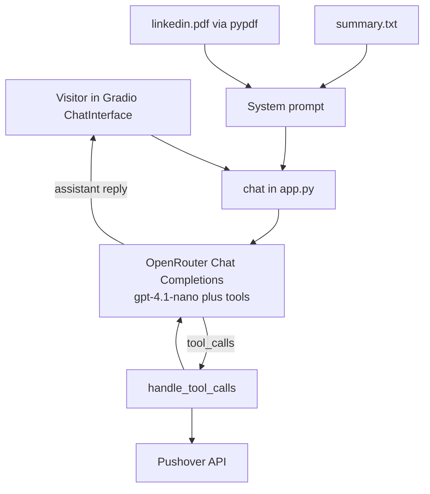
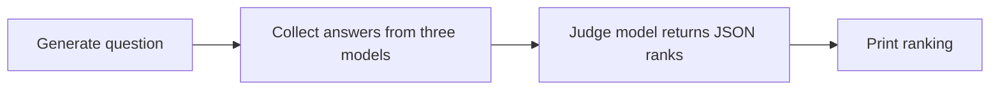

# Agentic AI Mastery

Hands-on work in applied LLM systems: a tool-calling digital twin and a multi-model evaluation notebook.

I am **Ahmad Abdul Rehman**, a software engineer (frontend) transitioning into AI engineering. This repository is part of my **Open Doors Scholarship** Master’s portfolio. It records what I have built so far—working Python applications that call hosted models, constrain behaviour with system prompts, and connect language models to tools and a user interface.

| | |
| --- | --- |
| Author | [Ahmad Abdul Rehman](https://www.linkedin.com/in/ahmad-khokhar-371a311b/) |
| GitHub | [github.com/ahmadabdul786](https://github.com/ahmadabdul786) |
| LinkedIn | [linkedin.com/in/ahmad-khokhar-371a311b](https://www.linkedin.com/in/ahmad-khokhar-371a311b/) |

---

## Overview

The repository contains two projects:

| Project | Role |
| --- | --- |
| [`twin/`](twin/) | Gradio chatbot that represents my professional profile and records leads or unanswered questions via tools |
| [`practice/first.ipynb`](practice/first.ipynb) | Notebook that compares several LLMs on the same question and ranks them with a judge model |

Together they cover the foundations of agentic applications: chat completions, persona and safety instructions, function calling, multi-model access through one API, and a lightweight LLM-as-judge evaluation.

---

## Digital Twin

A Gradio chat interface in which visitors can ask about my career, background, skills, and experience. The assistant stays on professional topics, declines to invent answers, and uses tools when someone wants to get in touch or when a question cannot be answered from the profile.

**Implementation**

- Biography from `summary.txt` and text extracted from `linkedin.pdf` (`pypdf`) are placed in the system prompt.
- Conversation history is sent to OpenRouter (`openai/gpt-4.1-nano`) through the OpenAI Python client.
- Two tools run in a loop while the model requests function calls:
  - `record_user_details` — email, optional name and notes
  - `record_unknown_question` — questions the profile cannot answer
- Both tools notify me through the [Pushover](https://pushover.net/) API (`requests`).
- Custom CSS and JavaScript in `styles.py` style the UI. The app binds to `0.0.0.0` and honours `PORT` (default `7860`) for hosted deployment. Hugging Face Spaces metadata is in `twin/README.md`.



---

## Multi-model comparison

`practice/first.ipynb` uses OpenRouter to:

1. Generate a short history question (`openai/gpt-4.1-nano`).
2. Collect answers from `openai/gpt-oss-20b:free`, `google/gemini-3.5-flash-lite`, and `openrouter/auto-beta`.
3. Rank those answers with a judge model (`poolside/laguna-xs-2.1:free`) that returns JSON.



---

## Technologies

| Area | Used |
| --- | --- |
| Language | Python 3.12 |
| Environment | `uv` (`pyproject.toml`, `uv.lock`) |
| LLM access | OpenRouter via the `openai` client (`base_url`) |
| Twin model | `openai/gpt-4.1-nano` |
| Interface | Gradio |
| PDF text | `pypdf` |
| Config | `python-dotenv` |
| Notifications | Pushover REST API (`requests`) |
| Notebook | Jupyter notebook, `ipykernel`, `IPython.display` |

**Concepts practised:** chat completions and message roles; system-prompt design; OpenAI-style function calling; multi-model comparison; LLM-as-judge evaluation; keeping secrets in environment variables.

---

## Repository structure

```
agentic-ai-mastery/
├── pyproject.toml
├── uv.lock
├── practice/
│   └── first.ipynb      # multi-model comparison
└── twin/
    ├── app.py           # Gradio app and tool loop
    ├── context.py       # PDF + summary → system prompt
    ├── tools.py         # tool schemas and Pushover
    ├── styles.py        # UI
    ├── summary.txt
    ├── linkedin.pdf
    └── requirements.txt # twin-only dependencies
```

---

## Setup

**Prerequisites:** Python 3.12+, [uv](https://docs.astral.sh/uv/), an [OpenRouter](https://openrouter.ai/) API key, and Pushover credentials for the twin’s notification tools.

```bash
uv sync
```

Create a `.env` in the repository root (gitignored). Run commands from the root so `load_dotenv()` finds it.

| Variable | Used by | Purpose |
| --- | --- | --- |
| `OPENROUTER_API_KEY` | Twin and notebook | OpenRouter authentication |
| `PUSHOVER_USER` | Twin tools | Pushover user key |
| `PUSHOVER_TOKEN` | Twin tools | Pushover application token |
| `PORT` | Twin (optional) | HTTP port; default `7860` |

```bash
OPENROUTER_API_KEY=your_openrouter_key
PUSHOVER_USER=your_pushover_user_key
PUSHOVER_TOKEN=your_pushover_app_token
```

**Run the digital twin**

```bash
uv run python twin/app.py
```

Open the Gradio URL (typically port `7860`). Profile files are resolved relative to `twin/`, so this command works from the repo root.

Optional twin-only install:

```bash
uv venv
uv pip install -r twin/requirements.txt
uv run python twin/app.py
```

**Run the notebook**

After `uv sync`, open `practice/first.ipynb` and select this project’s virtual environment as the kernel (`ipykernel` is included). `OPENROUTER_API_KEY` is required.

---

## Key learnings

- One OpenAI-compatible client can reach many models by setting `base_url` (here, OpenRouter).
- A digital twin in this project is a constrained chatbot: profile text lives in the system prompt, together with rules against inventing answers.
- Tool use is an application loop: the model requests a function, the code executes it, the result is returned as a tool message, and the model continues.
- Including a short PDF in the prompt is enough for a personal profile; the full extracted text is sent with each request.
- An LLM can rank other models’ answers from a JSON instruction; this notebook does not add further automatic metrics.
- Interface and hosting (`Gradio`, `PORT`, `0.0.0.0`) are part of making the work usable, not an afterthought.

---

## Limitations and future work

This is foundational work: a single-agent tool loop and a comparison notebook, not a production multi-agent system. Profile text is included in the prompt rather than retrieved; tool calls do not yet validate Pushover responses; and there are no automated tests.

Next steps I intend to take: more robust error handling, a durable record of captured leads, retrieval if the knowledge base grows, and implementing a fuller agent workflow as the next stage of this learning path.

---

Personal coursework unless a license is added.
